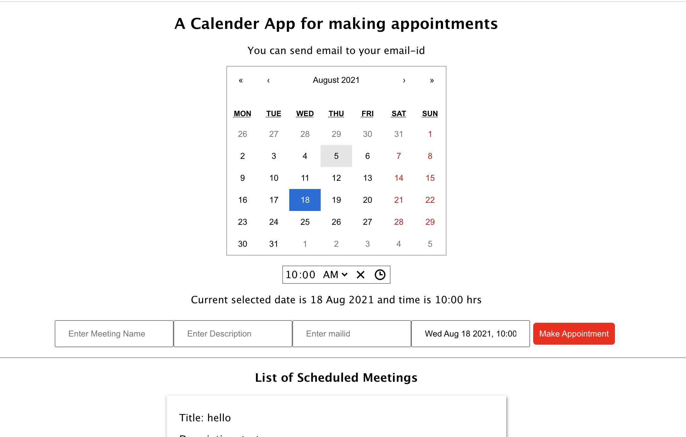

# CALCULATOR APP

It is a calendar meeting appointment app where you can send mail and notify about the meeting.

## Table of contents

- [Overview](#overview)
  - [Screenshot](#screenshot)
  - [Links](#links)
- [My process](#my-process)
  - [Built with](#built-with)
  - [What I learned](#what-i-learned)
  - [Useful resources](#useful-resources)
- [Author](#author)
- [Acknowledgments](#acknowledgments)

## Overview

The calendar app lets you select a date and time and send mail to the designated mail you want to send. There are no backend services connected for the user, so it will go only from one email id.

### Screenshot



### Links

- Live Site URL: [Live Website](https://kurosakicoder.github.io/CalendarAppointmentReact/)

## My process

First, I designed the React calendar and date input function. Then we displayed the input text on the front end. Then we connect emailjs to send mail.

### Built with

- JSX
- CSS
- React JS

### What I learned

I learn how to send mail from ReactJs and store a temporary JSON file

```js
[
  {
    id: 1,
    task: "Meeting",
    time: "11 May 2021",
    rtime: "10:00",
    complete: true,
  },
];
```

### Useful resources

- [React EmailJS](https://www.emailjs.com/docs/examples/reactjs/)

## Author

- LinkedIn - [Khaidem Sandip Singha ](https://www.linkedin.com/in/khaidemsandip/)
- Twitter - [@KurosakiCoder](https://twitter.com/KurosakiCoder)

## Acknowledgments

I have done this project from scratch by referencing the websites that I mentioned.
